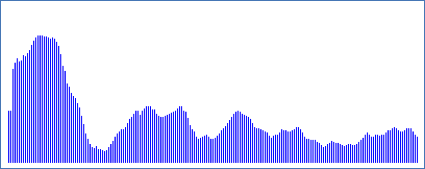
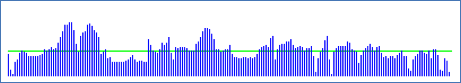

# Oppgave 5 - Visualisering

I denne oppgaven skal EasyGraphics-biblioteket brukes til å visualisere høydeprofil, hastighet og rute.

Dokumentasjon for metodene i EasyGraphics-bibliotekt kan finnes her https://dbsys.info/programmering/easygraphics/javadoc/index.html

### a) Høydeprofil

I denne oppgaven skal høyde-kurven for ruten gitt ved GPS datapunktene visualieres.

For GPS datafilen `medium.log` skal visualiseringen se ut som nedenfor der høyden på en vertikal linje svarer til høyden i GPS datapunktet.



I klassen `showProfile.java` finnes allerede en `main`-metode som setter opp et vindu som kan brukes til å tegne høydeprofilen og som ber om navn på den datafil som skal visualiseres (short, medium, long,vm).

Klassen sørger allerede for å lese inn data fra GPS datafilen ved oppstart og lagre GPS data i en tabell `gpspoints` med GPS punkter

```java
private GPSPoint[] gpspoints;
```

Implementer metoden

```java
showHeightProfile(int ybase)
```

som tegner høydeprofilen der parameteren `ybase` angir hvor på y-aksen bunnen av en søylene skal starte.

For å gjøre oppgaven enklere kan det antas at hvert punkt (pixel) i vinduet svarer til en høyde-meter. Eventuelt negative høyder skal ignoreres – dvs. behandles som om de hadde verdien 0.

**Hint:** Bruk en løkke for å iterere igjennom alle punktene og oppdater start (x,ybase)-punkt og slutt (x,y2)-punkt for linjer som kan tegnes med `drawLine`-metoden i EasyGraphics. Den symbolske konstanten `MARGIN` i klassen angir hvor på x-aksen den først vertikale linjen skal tegnes.

### b) Hastighet

I denne oppgaven skal hastigheten der blev kjørt med i løpet av ruten visualiseres. For GPS datafilen `medium.log` skal visualiseringen se slik ut



der denne grønne linjen indikerer gjennomsnittshastigheten for hele ruten.

Ferdiggjør implementasjonen av metoden `showSpeedProfile` i klassen `ShowSpeed.java`

Der finnes allerede en main-metode i klassen som setter opp vindu og som kaller metoden `showSpeedProfile`. GPS data blir automatisk lest inn i `gpspoints`-tabell  med samme navn som for høydeprofil ovenfor.

### c) Sykkelruten

I denne oppgaven ruten visualieres på et kart og til slutt skrive ut statistikk (nøkkeltall) om sykkelturen i øverste venstre hjørne. Et eksempel er vist nedenfor for log filen `medium.log`


der y-aksen svarer til breddegrader og x-aksen svarer til lengdegrader.

Ferdiggjør implementasjonen av metodene i klassen `ShowRoute.java`. Der finnes allerede en `main`-metode i klassen som setter opp vindu og som kaller de tre metodene `ShowRouteMap`, `ShowStatistics` og `PlayRoute`. Startkoden oppretter også et `GPSComputer`-objekt som kan brukes til å beregne nøkkeltall med.

Implementer metoden

```java
public double ystep()
```

som beregner hvor mange punkter (pixels) en breddegrad skal svare til for at vi kan tegne alle GPS datapunkter innen for et tegneområde på skjermen med et antall punkter i y-retningen som er gitt ved konstanten `MAPYSIZE`.

**Hint:** se implementasjonen av metoden `xstep()`. Vi antar her at jorden er flat dvs. en lengde og en breddegrad svarer til samme avstand uansett hvor vi befinner oss. Al den stund vi ikke sykler over veldig lange avstander er det en rimelig antagelse.

Implementer metoden

```java
showRouteMap(int ybase)
```

som tegner punkter i vinduet svarende til de (lengdegrad,breddegrad) posisjoner som finnes i GPS datafilen. Parameteren `ybase` angir det sted på y-aksen som skal svare til den minste breddegrad som finnes i datafilen.

Implementer metoden
```java
public void showStatistics()
```

som viser statistikk fra sykkelturen i øverste venstre hjørne (se bildet først i oppgaven ovenfor).

**Hint:** Easygraphics-metoden `drawString` kan brukes til å "tegne" en streng i vinduet. Metodene på objektet `gspcomputer` inne i klassen kan brukes til å finne de nøkkeltall som skal vises som del av statistikken.
